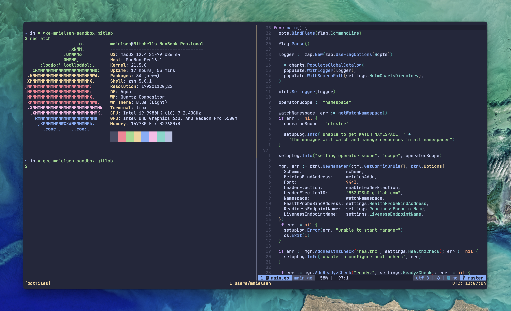

# dotfiles

Forever-changing dotfiles for tools I use.

[](https://gitlab.com/mitchenielsen/dotfiles/-/raw/main/img/screenshot.png)

## Installation

Run the following commands to set up the development environment:

```shell
git clone git@gitlab.com:mitchenielsen/dotfiles.git ~/dotfiles
cd ~/dotfiles
make
```

See the [Makefile](Makefile) for all available targets.